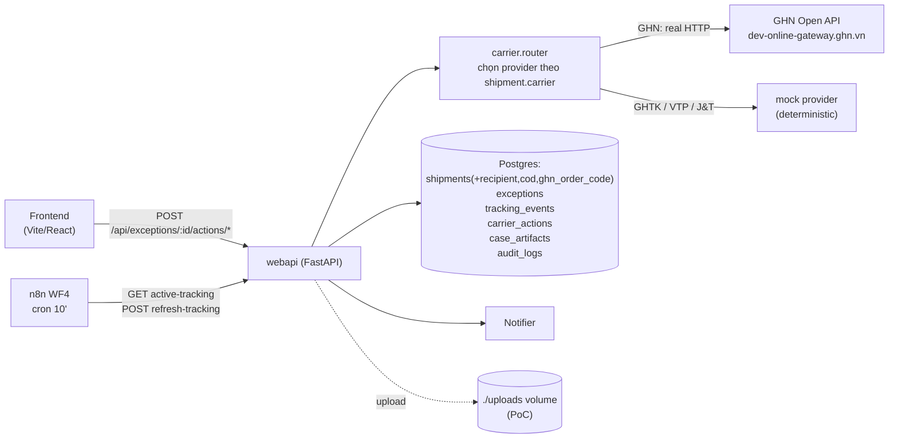

# Tích hợp GHN thật + thao tác xử lý exception thật (8 phase)

## Mục tiêu

Đưa hệ thống từ "demo trạng thái" sang **thực sự tác động lên đơn hàng**:
1. Ingest tracking thật từ GHN cho các đơn đã có trong DB.
2. Cho ops/manager bấm 5 thao tác xử lý sự cố và **API GHN thực sự thay đổi đơn**.
3. Mỗi thao tác có audit, idempotency, có thể rollback ý định bằng dry-run; lỗi phía carrier hiển thị rõ trong UI.
4. Mỗi phase chạy & demo độc lập để dễ debug, không cần phá hỏng mock pipeline đang chạy.

## Hiện trạng đã xác minh

- Shipment 100% mock từ [`services/mock-data/main.py`](services/mock-data/main.py); n8n WF1 cron 5' upsert vào `shipments` ([`n8n/workflows/wf1-ingestion-detection.json`](n8n/workflows/wf1-ingestion-detection.json)).
- Lifecycle exception chỉ đổi status: claim/assign/escalate/manager-review trong [`services/webapi/main.py`](services/webapi/main.py).
- Notifier nội bộ Telegram + Email ([`services/notifier/main.py`](services/notifier/main.py)).
- Schema: `shipments` (tracking_number unique, carrier, origin, destination, expected_delivery, status, failed_attempts, last_updated) ở [`migrations/001_s2_init.sql`](migrations/001_s2_init.sql); `exceptions` thêm assignee/deadline/sla_breached ở [`migrations/003_s7_ops_workflow.sql`](migrations/003_s7_ops_workflow.sql); `audit_logs(metadata jsonb)`.
- FE types: [`frontend/src/types.ts`](frontend/src/types.ts) — chưa có recipient/cod/ghn_order_code; cần mở rộng ở Phase 0.
- FE actions hiện có: claim/assign/escalate/manager-* trong [`frontend/src/lib/exceptionService.ts`](frontend/src/lib/exceptionService.ts).

## Kiến trúc đích



## Phase chung — quy ước

- **Branch**: 1 branch / phase. Mỗi phase phải PR riêng, có thể merge & demo độc lập.
- **Feature flag**: env `CARRIER_PROVIDER_MODE` ∈ `mock | live | shadow` (shadow = vẫn gọi GHN nhưng không đổi DB, chỉ log).
- **Idempotency**: FE luôn gửi header `Idempotency-Key: <uuid>`; BE unique index `carrier_actions.idempotency_key`.
- **Audit**: mỗi action ghi `audit_logs(action='carrier_<action>', metadata.carrier_action_id=...)`.
- **Test command** chuẩn cho mỗi phase: `pytest tests/` + cURL bên dưới (Phase 0/1/2/...).

---

## Phase 0 — Foundation (schema + abstraction, KHÔNG gọi mạng)

**Mục tiêu**: dựng nền tảng trừu tượng + bảng dữ liệu mới, mock provider trả response cố định để FE/BE chạy end-to-end mà chưa cần GHN token. Đây là phase quan trọng nhất để các phase sau dễ debug.

**Files**
- Tạo [`migrations/004_s8_carrier_actions.sql`](migrations/004_s8_carrier_actions.sql) (mới):
  - `ALTER TABLE shipments ADD COLUMN recipient_name TEXT, recipient_phone TEXT, recipient_address TEXT, recipient_ward_code TEXT, recipient_district_id INT, cod_amount NUMERIC(12,0) DEFAULT 0, ghn_order_code TEXT UNIQUE`.
  - `tracking_events(id, shipment_id FK, occurred_at TIMESTAMPTZ, status_code TEXT, location TEXT, description TEXT, raw JSONB, source TEXT, created_at)`.
  - `carrier_actions(id, exception_id FK, shipment_id FK, action_type TEXT, request JSONB, response JSONB, http_status INT, status TEXT CHECK (status IN ('pending','success','failed')), idempotency_key TEXT UNIQUE, error_code TEXT, error_message TEXT, created_by TEXT, created_at, completed_at)`.
  - `case_artifacts(id, exception_id FK, kind TEXT, file_path TEXT, mime TEXT, size_bytes INT, uploaded_by TEXT, created_at)`.
  - Indexes: `tracking_events(shipment_id, occurred_at DESC)`, `carrier_actions(exception_id, created_at DESC)`.
- Tạo `services/carrier/` (mới):
  - `services/carrier/base.py` — ABC `CarrierProvider` với 6 method:
    ```python
    fetch_tracking(ghn_order_code, tracking_number) -> TrackingResult
    cancel(order_code, reason) -> ActionResult
    update_address(order_code, recipient: AddressPatch) -> ActionResult
    reschedule_delivery(order_code, new_time, note) -> ActionResult
    reschedule_pickup(order_code, new_time, note) -> ActionResult
    open_claim(order_code, claim: ClaimPayload) -> ActionResult  # có thể NotSupported
    ```
  - `services/carrier/types.py` — Pydantic: `TrackingEvent`, `TrackingResult`, `AddressPatch`, `ActionResult{ok, raw, error_code?, error_message?, http_status}`.
  - `services/carrier/mock.py` — sinh response deterministic (theo seed = `tracking_number`).
  - `services/carrier/router.py` — `get_provider(carrier_name) -> CarrierProvider` dựa trên env + carrier code.
- Sửa [`services/webapi/main.py`](services/webapi/main.py): thêm scaffolding endpoints (chưa gọi provider) trả 501 `not_implemented` để FE tích hợp trước.
- Sửa [`frontend/src/types.ts`](frontend/src/types.ts): thêm `recipient_name|phone|address|ward_code|district_id|cod_amount|ghn_order_code`, type `TrackingEvent` mới.
- Sửa [`frontend/src/pages/ExceptionDetailPage.tsx`](frontend/src/pages/ExceptionDetailPage.tsx): thêm tab “Tracking thực tế” hiển thị `tracking_events` (rỗng OK) + nút Refresh disabled (sẽ enable Phase 1).

**Acceptance / DoD**
- `docker compose exec postgres psql -U shipment -c "\d carrier_actions"` thấy bảng + index.
- `curl -X POST .../actions/refresh-tracking -H 'Idempotency-Key: x'` → `501`.
- `pytest tests/carrier/test_router.py` xác nhận `router.get_provider('GHN')` trả `GhnProvider` (chưa cài), `router.get_provider('GHTK')` trả `MockProvider`.
- FE build pass, hiển thị tab Tracking trống không crash.

**Cách debug**
- Bật `LOG_SQL=1` để in query khi test migration.
- `mock provider` phải có flag `MOCK_LATENCY_MS` để giả lập độ trễ — dễ test loading state ở FE.

**Rủi ro**
- Khi alter `shipments` thêm cột không-null sẽ fail nếu có row cũ; phải để DEFAULT/nullable.

---

## Phase 1 — GHN read-only: pull tracking thật

**Mục tiêu**: Lấy lịch sử di chuyển thực tế của 1 đơn GHN và hiển thị trong UI. Demo bằng 1 đơn sandbox nhập tay.

**GHN endpoints sẽ dùng**
- `POST /shiip/public-api/v2/shipping-order/detail` — body `{order_code}`, header `Token`, `ShopId`.
- `POST /shiip/public-api/v2/shipping-order/tracking-logs` (nếu account có quyền) — fallback đọc từ `log` của detail.

**Files**
- `services/carrier/ghn.py` (mới) — `class GhnProvider(CarrierProvider)`:
  - Constructor đọc `GHN_TOKEN`, `GHN_SHOP_ID`, `GHN_BASE_URL` từ env.
  - `fetch_tracking`: gọi `shipping-order/detail`; map response → `TrackingResult{events: list[TrackingEvent], current_status, expected_delivery_at}`.
  - Map status code GHN (`ready_to_pick, picking, money_collect_picking, picked, storing, transporting, sorting, delivering, money_collect_delivering, delivered, delivery_fail, waiting_to_return, return, returned, ...`) → `ExceptionStatus` & `tracking_events.status_code`.
- Cập nhật [`services/webapi/main.py`](services/webapi/main.py):
  - `POST /api/exceptions/{id}/actions/refresh-tracking` (ops/employee/manager đều dùng được; employee không xem được CRITICAL):
    1. Load shipment + exception.
    2. Gọi `provider.fetch_tracking`.
    3. UPSERT `tracking_events` (dedupe theo `(shipment_id, occurred_at, status_code)`).
    4. Update `shipments.status`, `shipments.last_updated`, `shipments.actual_delivery` nếu delivered.
    5. Ghi `carrier_actions` (success/failed).
    6. Ghi `audit_logs(action='carrier_refresh_tracking')`.
    7. Trả `{tracking_events[], shipment_status, exception_status}`.
  - `POST /api/shipments/import-ghn` (ops/manager only) — body `{order_code}`: gọi GHN detail → INSERT `shipments` (set `ghn_order_code`, recipient, COD, expected_delivery) → trigger detector hiện có để sinh `exception` nếu cần. Đây là cách demo nhập 1 đơn thật.
- Sửa [`frontend/src/lib/exceptionService.ts`](frontend/src/lib/exceptionService.ts): thêm `refreshTracking(id)` và `listTrackingEvents(shipmentId)`.
- Sửa [`frontend/src/pages/ExceptionDetailPage.tsx`](frontend/src/pages/ExceptionDetailPage.tsx): tab “Tracking thực tế” enable nút Refresh, hiển thị timeline ngược thời gian, badge cho event mới sau lần refresh trước.
- Thêm trang `/ops/import-shipment` đơn giản: nhập `order_code` → gọi import-ghn → redirect detail.

**Acceptance / DoD**
- Cài GHN sandbox, paste 1 `order_code` thật → import thành công, FE hiển thị recipient, COD, expected_delivery.
- Bấm Refresh → tab Tracking hiển thị các event GHN trả về; bảng `tracking_events` có dữ liệu thật; mỗi lần bấm không tạo duplicate.
- Khi delivered → `exception.status` tự đổi `resolved`, sla_breached=false, ghi audit.
- Lỗi token sai → UI hiện toast `"Carrier auth lỗi (401)"`, không crash.

**Cách debug**
- Endpoint `GET /api/dev/carrier-test?order_code=...` (chỉ khi `APP_ENV=dev`) để gọi thẳng provider không cần exception — phục vụ Postman.
- Header response trả lại `X-Carrier-Action-Id` để tra log nhanh trong DB.
- Log structured JSON, có `carrier=ghn, op=fetch_tracking, http_status, latency_ms`.

**Rủi ro**
- GHN có thể trả schema khác giữa các tài khoản (shop có/không hỗ trợ tracking logs); cần fallback parse `log[]` trong response của `detail`.
- Token sandbox khác token prod — nhớ chỉ commit `GHN_BASE_URL` cho sandbox.

---

## Phase 2 — Action thật đầu tiên: change-address

**Lý do chọn đầu tiên**: an toàn (đổi địa chỉ thường có thể đảo lại), GHN có endpoint sẵn, lỗi phổ biến → dataset test phong phú.

**GHN endpoint**: `POST /shiip/public-api/v2/shipping-order/update`
- Fields cần: `order_code`, `to_name`, `to_phone`, `to_address`, `to_ward_code`, `to_district_id`.
- GHN master-data: `master-data/province`, `master-data/district?province_id=`, `master-data/ward?district_id=`.

**Files**
- `services/carrier/ghn.py`: implement `update_address`.
- `services/carrier/ghn_master_data.py` (mới) — wrapper Province/District/Ward, có cache trong Redis 24h (key `ghn:province`, `ghn:district:{pid}`, `ghn:ward:{did}`).
- [`services/webapi/main.py`](services/webapi/main.py):
  - `POST /api/exceptions/{id}/actions/change-address` body:
    ```json
    {"recipient_name":"...","recipient_phone":"...","address":"...",
     "ward_code":"...","district_id":1442,"reason":"..."}
    ```
  - Validate phone (regex VN), `ward_code` & `district_id` non-empty.
  - Gọi `provider.update_address`; nếu success → update `shipments.recipient_*`; ghi `carrier_actions` + audit.
  - `GET /api/carrier/ghn/provinces`, `/districts?province_id=`, `/wards?district_id=` (proxy + cache).
- FE: `services/exceptionService.ts` thêm `changeAddress`; component `ChangeAddressModal.tsx` (mới):
  - 3 dropdown cascade Province → District → Ward.
  - Preview "Trước/Sau" (so sánh với recipient hiện tại).
  - Nút **Gửi** trong `disabled` cho đến khi đủ trường + có `reason`.
  - Confirm 2 bước: hiện request payload sẽ gửi.
  - On success: refetch detail + toast.

**Acceptance / DoD**
- Đổi địa chỉ 1 đơn sandbox sang quận khác → GHN trả `code=200`; refresh tracking thấy địa chỉ mới.
- Bấm Submit nhanh 2 lần (cùng Idempotency-Key) → chỉ 1 record `carrier_actions`.
- Sai ward_code → UI hiển thị `error_message` GHN trả về (vd `to_ward_code is invalid`).
- Trong audit log hiện `carrier_change_address` với metadata `before/after`.

**Edge cases**
- Đơn đã `picked` ở GHN có thể không cho update — phản ánh đúng error code, không tự rollback DB.
- Phone trùng `recipient_phone` cũ → UI cảnh báo nhẹ nhưng vẫn cho gửi.

---

## Phase 3 — Cancel order

**GHN endpoint**: `POST /shiip/public-api/v2/switch-status/cancel` body `{order_codes: [order_code]}`.

**Files**
- `services/carrier/ghn.py`: `cancel`.
- [`services/webapi/main.py`](services/webapi/main.py):
  - `POST /api/exceptions/{id}/actions/cancel` body `{reason}` (reason min 10 chars).
  - Quy tắc trạng thái: cancel thành công → `shipments.status='cancelled'`, `exception.status='resolved'`, `resolved_at=now`, set `resolution_note += "[CANCEL] " + reason`.
  - Cancel thất bại từ GHN (đơn đã giao/đang chuyển hoàn) → giữ nguyên DB, ghi audit `carrier_cancel_failed`.
- FE: `CancelOrderModal.tsx`:
  - Yêu cầu nhập lý do (bắt buộc).
  - Checkbox `"Tôi hiểu thao tác không thể đảo lại"` → enable nút Đỏ.
  - Confirm 2 bước. Sau success: chuyển case sang trang detail (status resolved).

**Acceptance / DoD**
- Cancel sandbox order → `shipping-order/detail` sau đó trả status `cancel`.
- Cancel 2 lần liên tiếp → lần 2 trả lỗi của GHN, FE hiện rõ.
- Audit log có chuỗi: `carrier_cancel` → `manager_resolved` (auto).

**Edge cases**
- Đơn `delivering` (đang ship) đôi khi GHN cho cancel, đôi khi không — không cố thử lại tự động.
- Không cho employee cancel; chỉ ops + manager.

---

## Phase 4 — Reschedule delivery + reschedule pickup

GHN không có endpoint riêng "reschedule"; thực tế dùng `update` với các field:
- Reschedule giao: `deliver_station_id` (không dùng), hoặc gửi `note` vào `required_note` + chỉnh `pick_shift`/`required_note` cho lần thử kế. Cho PoC: dùng `update` với `required_note='SCHEDULE:HHMM'` + `note` text.
- Reschedule pickup (đơn chưa pick): `update` với `pick_shift` (mảng số 1/2/3 = sáng/chiều/tối) + `pickup_time` (epoch).

**Files**
- `services/carrier/ghn.py`: `reschedule_delivery`, `reschedule_pickup`.
- BE endpoints:
  - `POST /api/exceptions/{id}/actions/reschedule-delivery` body `{schedule_at: ISO, note}`.
  - `POST /api/exceptions/{id}/actions/reschedule-pickup` body `{pickup_at: ISO, shift: 1|2|3, note}`.
  - Validate time trong tương lai gần (≥ 1h, ≤ 7 ngày).
- FE: `RescheduleModal.tsx` — date+time picker, dropdown shift; preview slot human-readable (`"Sáng mai 8-12h"`).

**Acceptance / DoD**
- Reschedule pickup cho đơn `ready_to_pick` → GHN detail thấy `pick_shift` mới.
- Reschedule delivery cho đơn đã giao thất bại 1 lần → `required_note` + ghi `carrier_actions.response`.
- 2 endpoint hoạt động đúng theo trạng thái đơn (UI ẩn nút không hợp lệ).

**Edge cases**
- Múi giờ: lưu UTC, render `Asia/Ho_Chi_Minh`. Dùng cùng tz với `GENERIC_TIMEZONE` trong `.env`.

---

## Phase 5 — Open claim + upload artifacts

**Lưu ý quan trọng**: GHN không có endpoint claim public. Phase này tạo **claim nội bộ** (workflow công ty), kèm chứng từ đính kèm; gửi yêu cầu thực tế qua kênh email/Telegram bằng notifier có sẵn.

**Files**
- [`services/webapi/main.py`](services/webapi/main.py):
  - `POST /api/exceptions/{id}/artifacts` (multipart): lưu vào volume `./uploads/{exception_id}/{uuid}.{ext}`, INSERT `case_artifacts`.
  - `GET /api/exceptions/{id}/artifacts` (list).
  - `GET /api/artifacts/{id}/download` (stream file, RBAC: ops/manager/employee owner).
  - `POST /api/exceptions/{id}/actions/open-claim` body `{type: 'lost'|'damaged'|'wrong_recipient'|'cod_mismatch', description, evidence_artifact_ids: [uuid]}`:
    - Validate ≥ 1 artifact ảnh.
    - INSERT `carrier_actions` (action_type='open_claim', status='pending').
    - Gọi notifier gửi mail + Telegram tới manager (chuẩn case escalation).
    - Set `exception.status='waiting_manager_review'`, `is_escalated=true`.
- Compose: thêm volume `./uploads:/app/uploads` cho service `api`.
- FE: `ClaimModal.tsx` — chọn type, description, kéo thả ảnh; thumbnail preview; bắt buộc ≥ 1 ảnh.
- FE: tab **Chứng từ** mới trong [`frontend/src/pages/ExceptionDetailPage.tsx`](frontend/src/pages/ExceptionDetailPage.tsx).

**Acceptance / DoD**
- Upload 3 ảnh JPG/PNG ≤ 5MB ok; vượt size → 413 + toast.
- Mở claim → manager nhận Telegram + email với link case + link tải artifact (trong intranet).
- Ảnh hiển thị thumb trên timeline audit, click mở viewer.

**Bảo mật**
- Validate MIME thật bằng magic bytes (chấp nhận `image/jpeg, image/png, application/pdf`).
- Filename random uuid; không trust filename gốc; max 5MB/ảnh, 5 ảnh/claim.

---

## Phase 6 — n8n WF4 polling + auto-resolve

**Mục tiêu**: tự động refresh tracking những exception đang active để bắt sự kiện carrier ngoài giờ làm.

**Files**
- [`services/webapi/main.py`](services/webapi/main.py): thêm `GET /api/exceptions/active-tracking` trả list `{exception_id, ghn_order_code, last_polled_at}` cho status ∈ {open, notified, in_progress, waiting_manager_review}, sort `last_polled_at NULLS FIRST` để xoay vòng.
- Sửa endpoint refresh-tracking: cập nhật `shipments.last_polled_at`.
- `n8n/workflows/wf4-tracking-poller.json` (mới):
  - Cron `*/10 * * * *`.
  - HTTP GET active-tracking (limit 50 mỗi tick, JWT system).
  - Loop: HTTP POST refresh-tracking, mỗi request kèm `Idempotency-Key=poll-{ts}-{id}`.
  - Branch: nếu carrier_status='delivered' → call PATCH exception status=resolved (đã làm tự động trong refresh-tracking → có thể bỏ).
- Tạo system user `n8n-bot` + JWT dài hạn; lưu trong n8n credential.

**Acceptance / DoD**
- Sau 10 phút, các đơn active có `last_polled_at` cập nhật.
- Đơn delivered tự đóng case kèm `resolution_note='[AUTO] delivered by carrier'`.
- Không bị "thundering herd": rate limit GHN 1 req/s/đơn (đảm bảo bằng Redis bucket Phase 7).

**Cách debug**
- Trong n8n UI: xem execution log từng tick.
- Bật `CARRIER_PROVIDER_MODE=shadow` để n8n vẫn poll nhưng không update DB.

---

## Phase 7 — Hardening

**Files**
- `services/carrier/rate_limit.py` — token bucket Redis (key `rl:ghn:{op}`, refill 5/s, burst 20).
- `services/carrier/errors.py` — map GHN error code → enum `ERR_AUTH | ERR_VALIDATION | ERR_STATE_CONFLICT | ERR_NETWORK | ERR_UNKNOWN`; FE i18n 5 message.
- `services/carrier/ghn.py`: retry chỉ với `ERR_NETWORK` (max 3, backoff 0.5/1.5/4s).
- Mode `shadow`: `update`/`cancel`/... vẫn gọi GHN sandbox nhưng KHÔNG ghi đổi `shipments.*`; chỉ ghi `carrier_actions(status='shadow')`.
- Logs: format JSON `{ts, level, op, carrier, exception_id, http_status, latency_ms, idempotency_key, error_code}` (`structlog` hoặc tự viết).
- Tests:
  - `tests/carrier/test_ghn_mapping.py` — fixtures JSON cho status mapping.
  - `tests/carrier/test_idempotency.py` — gửi 2 request cùng key → 1 row.
  - `tests/integration/test_change_address_flow.py` — dùng `respx`/`httpx_mock` giả GHN.
- README mới `docs/carrier-integration.md` (chỉ tạo nếu user ok): vận hành, secret, troubleshooting.

**Acceptance / DoD**
- 1 carrier request lỗi 500 GHN → retry 3 lần, log có `attempt=1..3`, cuối cùng FE thấy `error_code=ERR_NETWORK`.
- `pytest -q` xanh; coverage `services/carrier/` ≥ 80%.
- Mode `shadow` bật: action thử nghiệm không làm hỏng dữ liệu.

---

## Phase 8 (tùy chọn) — Scale ideas cho "wow factor" đồ án

Chọn 1-2 sau khi 7 phase trên ổn:

1. **Predictive late-risk** — feature đơn giản nhất nhưng dễ ấn tượng:
   - Tính score `risk_score = f(overdue_hours, hours_since_last_event, exception_history_per_route, carrier_avg_delay)`.
   - Heuristic + linear model chạy nội bộ; hiển thị badge màu trên dashboard và sort.
   - Files: `services/risk/score.py`, cột `exceptions.risk_score`, FE thêm cột.
2. **Customer comms qua Zalo OA / SMS** — khi exception severity ≥ HIGH, gửi link 1-time-token cho người nhận (đổi địa chỉ / chọn lấy tại bưu cục).
3. **Multi-tenant lite** — bảng `tenants` + `users.tenant_id`; mỗi tenant config GHN token riêng. Hữu ích nếu chuyển sang MVP startup sau đồ án.
4. **AI copilot panel** — gợi ý action dựa lịch sử case tương tự (RAG trên `audit_logs` + `tracking_events`) trong tab Detail.
5. **Real-time UI** — Postgres LISTEN/NOTIFY → SSE → FE cập nhật badge & list không cần polling.
6. **Cost ledger** — bảng `case_costs(action_type, amount, currency)`; báo cáo chi phí xử lý exception/tháng.

Khuyến nghị cho đồ án: chọn (1) + (2). Bộ đôi này thể hiện cả AI/data và tích hợp đa kênh, kể được câu chuyện business rõ ràng.

---

## Cấu hình & secret tổng hợp

Bổ sung `.env`:
```
GHN_BASE_URL=https://dev-online-gateway.ghn.vn
GHN_TOKEN=
GHN_SHOP_ID=
CARRIER_PROVIDER_MODE=mock
UPLOADS_DIR=/app/uploads
```

Secret rotation: token GHN không commit; tạo `secrets/.gitignore` bỏ qua. Khuyến nghị Phase 7 thêm `dotenv-vault` hoặc đơn giản là tài liệu `docs/SETUP.md`.

## Rủi ro & checklist trước khi bắt đầu

- [ ] Có tài khoản GHN (sandbox hoặc prod-shop) chưa? Cần `Token` + `ShopId`.
- [ ] Hiện `actions/refresh-tracking` chưa có nên Phase 0 sẽ trả 501 — confirm bạn chấp nhận FE thấy "Tính năng đang triển khai".
- [ ] Volume `./uploads` ổn cho PoC; production cần S3/MinIO (ngoài phạm vi).
- [ ] Status mapping GHN ↔ system: cần list cụ thể (sẽ chốt khi vào Phase 1, dựa trên tracking_events thật).

## Phụ lục — bảng action × phase × endpoint

- Phase 0: scaffold endpoints (501) — tất cả 6 action
- Phase 1: refresh-tracking (live)
- Phase 2: change-address (live)
- Phase 3: cancel (live)
- Phase 4: reschedule-delivery, reschedule-pickup (live)
- Phase 5: open-claim (internal), artifacts upload/list/download
- Phase 6: poller cron (consume refresh-tracking)
- Phase 7: rate-limit / shadow / structured logs / tests
- Phase 8: pick scale features
